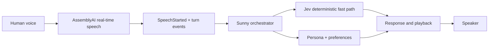

# Sunny — Adaptive Real-Time Voice Companion

Sunny is an adaptive voice companion that learns the conversational preferences around a person’s speech: pacing, pauses, turn-taking, and the moment they want to interrupt. It was created as **MI-087** for the **AssemblyAI Voice Agent Hackathon**.

[View the live demo](https://rickytzai.github.io/sunny-mi087/) · [Watch the submission film](https://rickytzai.github.io/sunny-mi087/assets/sunny-demo.mp4)


> The public film is a visualized product experience. It is not the literal human evidence recording and contains no raw human audio or transcript.

## The problem

Voice assistants often optimize for answering quickly while missing the rhythm of a real conversation. They may speak through a pause, make interruptions feel awkward, or respond with the same timing for every person.

## The solution

Sunny treats conversational rhythm as part of the experience. It combines real-time speech events with a lightweight preference layer so it can listen, respond, and yield the floor more naturally. A deterministic fast path handles small timing decisions while the companion keeps its persona and conversational behavior coherent.

## AssemblyAI’s role

AssemblyAI provides the real-time speech signal that drives the interaction. Speech activity and completed turns feed Sunny’s orchestration layer, where interruption control, turn policy, persona context, and response generation work together.



## How Sunny works

1. The microphone provides live speech to AssemblyAI.
2. Real-time speech events identify activity and conversational turns.
3. Sunny combines those events with persona and preference context.
4. A deterministic fast path makes small, time-sensitive decisions.
5. The response is played with timing shaped by the current conversation.

### True barge-in

When the user begins speaking during playback, Sunny yields immediately:

```text
SpeechStarted → playback stop/duck → new human turn → Sunny response
```

The public demo visualizes this state transition. It does not claim a measured latency.

## Verified status

- ✅ **Human E2E verified** — physical human microphone → AssemblyAI v3 speech events → Sunny → speaker
- ✅ **True human barge-in verified** — playback active → `SpeechStarted` → playback stop/duck → new human turn → new Sunny response
- ✅ **AssemblyAI real-time speech events used**

These statements reflect completed human validation recorded by the project team. The private evidence itself is intentionally excluded from this public repository.

## Run the demo locally

The demo is a dependency-free static site. From the repository root:

```bash
python -m http.server 8000
```

Then open `http://localhost:8000`.

No API key is needed because the public page does not run the production backend in the browser.

## Repository structure

```text
.
├── index.html
├── styles.css
├── app.js
├── assets/
│   ├── sunny-hero.jpg
│   ├── sunny-demo.mp4
│   └── architecture.svg
├── .nojekyll
└── .gitignore
```

## Privacy

This repository is a sanitized presentation layer. It contains no API keys, credentials, environment files, raw human audio, plaintext human transcripts, private evidence archives, mailbox or shared-state data, or machine-specific paths. The submission film uses original synthesized music and does not contain the private human evidence recording.

## Claim boundary

The repository makes no benchmark, latency, availability, or browser-backend claim. The landing page is a static product visualization for judging; it does not expose or emulate the production service.
