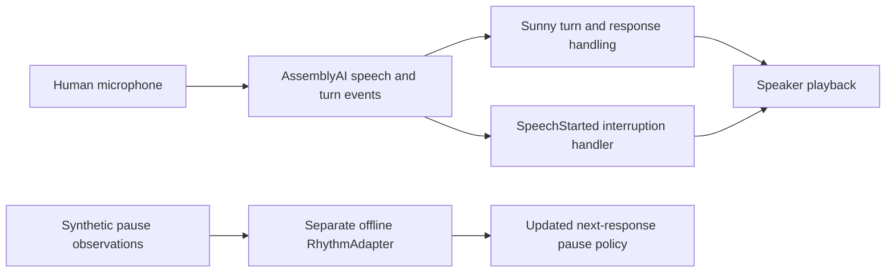

# Sunny — Adaptive Conversation Layer for Voice Agents

**AssemblyAI supplies live speech and turn signals. Sunny handles the response and yields playback when a human interrupts.** A separate existing offline rhythm prototype updates a bounded response-pause policy. Human voice validation and offline adaptation are distinct evidence tracks.

## For Judges — verify Sunny in 60 seconds

1. **Who does what:** [AssemblyAI vs Sunny](docs/architecture.md). AssemblyAI supplies speech/turn events; Sunny routes accepted turns and controls playback.
2. **Human E2E:** [redacted completion record](evidence/human-e2e-redacted.json), session `20260928_184302`: physical mic → AssemblyAI → Sunny → speaker.
3. **True barge-in:** [recorded event timeline](docs/human-validation.md), session `20260928_184855`: SpeechStarted → PlaybackStop trigger → TurnFinal → new response. Real relative timestamps; no acoustic-latency claim.
4. **What learns:** [source-backed offline proof](docs/learning-proof.md), [executable existing code excerpt](proof/rhythm_excerpt.py), [provenance and replay](evidence/learning-source-proof.json). Synthetic 900 ms observations change the next-pause policy **300 → 360 → 414 ms**. These are policy values, not performance metrics. Not integrated into the human-validation path.
5. **Run actual public tests:** clone this repo, then run `python -m unittest discover -s tests -v` (Python 3.9+, standard library only). Tests execute the numerical excerpt and check provenance, state changes, bounds and recorded-event ordering; legacy fixtures remain labeled synthetic.
6. **Watch:** [final 95-second film](https://rickytzai.github.io/sunny-mi087/assets/sunny-demo-v5.mp4) — **01:05–01:20 contains sanitized real-microphone event proof**. [Live demo page](https://rickytzai.github.io/sunny-mi087/) · [LabLab submission](https://lablab.ai/ai-hackathons/assemblyai-voice-agent-hackathon/sunny-voice-agent/sunny-adaptive-real-time-voice-companion).

## Problem and solution

Voice conversations need clear turn boundaries and reliable interruption handling. Sunny uses AssemblyAI speech events to route the accepted human turn and stop active playback on new speech. The existing offline rhythm experiment explores a bounded next-response pause policy using a rolling mean and smoothing.

This submission provides functional human voice validation plus reproducible numerical adaptation evidence. It does not claim the live human flow already learns preferences, speech emotion, identity or personality.

## Architecture



The offline component is intentionally drawn separately: its integration into the live microphone harness is not verified. See [architecture](docs/architecture.md) and [learning proof](docs/learning-proof.md).

## True human barge-in

`Playback active → AssemblyAI SpeechStarted → Sunny PlaybackStop trigger → TurnFinal / new turn → Sunny response`

The inspected handler stops playback when a provider event arrives while playback is active. The published [relative event timeline](evidence/human-validation-timeline.json) retains event ordering from the existing human session. Equal event timestamps do not establish zero physical latency.

## Evidence status

| Claim | Supported scope | Evidence |
| --- | --- | --- |
| Human microphone E2E | Verified functional, existing physical-device session | [E2E summary](evidence/human-e2e-redacted.json) |
| True human barge-in | Verified functional, recorded event ordering | [timeline and caveats](docs/human-validation.md) |
| State update changes later pause policy | Verified existing offline numerical implementation, synthetic replay | [source proof](docs/learning-proof.md) |
| Live automatic learning / persisted personalization | NOT_ENOUGH_EVIDENCE | Not claimed |
| JEF feedback loop | OMITTED_NOT_SUPPORTED | Existing Jev router is not JEF |
| Relationship-aware preference distillation | OMITTED_NOT_SUPPORTED | Future work; not a submission capability |
| Baseline comparison / latency / preference accuracy | NOT YET BENCHMARKED | No comparative metrics claimed |

The private runtime includes exploratory modules outside this submission's public scope. We publish only the reviewed numerical excerpt, not broad persona or mood profiles. See the [audit limits](docs/learning-proof.md#reviewer-terminology-audit).

## Setup and run

```bash
git clone https://github.com/rickytzai/sunny-mi087.git
cd sunny-mi087
python -m unittest discover -s tests -v
python -m http.server 8000
```

Open `http://localhost:8000`. The website is static and needs no API key. The public repo does not run the production microphone backend in a browser.

## Film and privacy

The final film combines a scripted animated product visualization with a clearly labeled sanitized event-proof segment. Character dialogue is synthesized; the animated woman is not the human tester. No tester audio, captured waveform, transcript or voice conversion is included.

The public repo excludes secrets, environment files, raw human audio, plaintext human transcripts, private paths, operational/shared-state data and private archives. Identity, personality, voiceprint and emotion inference are outside the published numerical proof. [Privacy](PRIVACY.md) · [Evidence boundaries](docs/evidence-status.md).

## Future work

Live wiring of the offline rhythm policy, persisted bounded preferences, relationship-aware preference distillation and a packaged SDK/API are future work. They are not represented as completed features.
